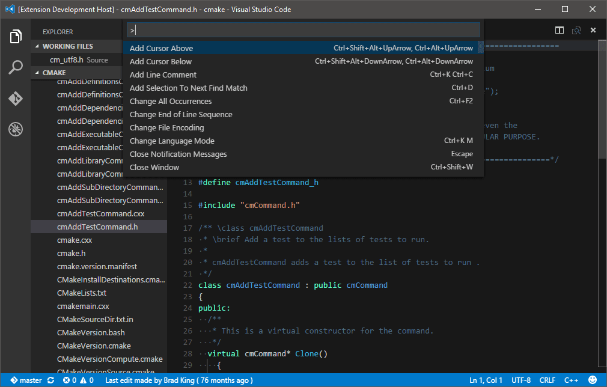

# Toggle Header/Source for VS Code

[][marketplace] [][gh-repo] [][issues] [][gitter]

## Description
Toggle Header/Source is a [VS Code][vscode] extension which lets you quickly switch between headers and source files written in C, C++ and Objective-C.

It helps you getting more productive by minimizing the time required to switch between both.

## Usage
Just hit the `F4` key. That's it!

If the shortcut has been defined to another command, you can still press `F1` and select the command with title: `Toggle Header/Source`.

## Installation
Hit `Ctrl+P` and enter the `ext install toggle header/source` command. **Warning:** be sure to select the extension authored from **bbenoist**.

## Issues / Feature requests
You can submit your issues and feature requests on the GitHub [issues page][issues].

## Contributing
See [`CONTRIBUTING.md`][contributing-md] for guidelines.

[][license] [][npm-dependencies] [][npm-devdependencies]

## More information
* [Toggle Header/Source on the Visual Studio Marketplace][marketplace]
* [GitHub repository][gh-repo]

## Other extensions you might like
* [Vagrant][vagrant]
* [Shell][shell]
* [QuickTips][quicktips]
* [Doxygen Language Support][doxygen]
* [QML Language Support][qml]
* [Nix Language Support][nix]

[marketplace]: https://marketplace.visualstudio.com/items/bbenoist.togglehs
[gh-repo]: https://github.com/bbenoist/vscode-togglehs
[issues]: https://github.com/bbenoist/vscode-togglehs/issues/
[gitter]: https://gitter.im/bbenoist/vscode-togglehs
[npm-dependencies]: https://david-dm.org/bbenoist/vscode-togglehs
[npm-devdependencies]: https://david-dm.org/bbenoist/vscode-togglehs#info=devDependencies
[contributing-md]: https://github.com/bbenoist/vscode-togglehs/tree/master/CONTRIBUTING.md
[license]: https://raw.githubusercontent.com/bbenoist/vscode-togglehs/master/LICENSE
[vscode]: https://code.visualstudio.com/
[vagrant]: https://marketplace.visualstudio.com/items?itemName=bbenoist.Vagrant
[shell]: https://marketplace.visualstudio.com/items?itemName=bbenoist.Shell
[quicktips]: https://marketplace.visualstudio.com/items?itemName=bbenoist.QuickTips
[doxygen]: https://marketplace.visualstudio.com/items?itemName=bbenoist.Doxygen
[qml]: https://marketplace.visualstudio.com/items?itemName=bbenoist.QML
[nix]: https://marketplace.visualstudio.com/items?itemName=bbenoist.Nix
